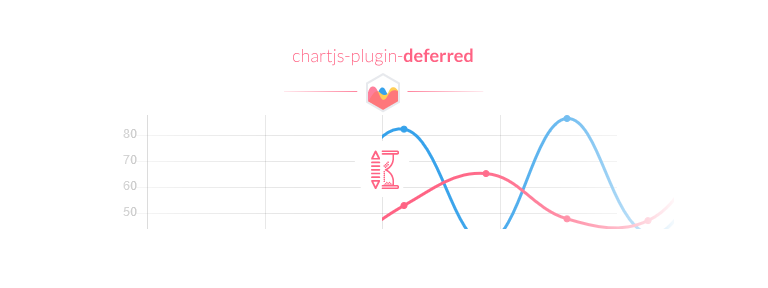

[Chart.js](http://www.chartjs.org/) plugin to defer initial chart updates until the user scrolls and the canvas appears inside the viewport, and thus trigger the initial chart animations when the user is likely to see them.

**Important:** requires [Chart.js](https://github.com/chartjs/Chart.js/releases) **2.6.0** or later.

## Table of Contents



## Example

```javascript
new Chart(ctx, {
  // ... data ...
  options: {
    // ... other options ...
    plugins: {
      deferred: {
        xOffset: 150,   // defer until 150px of the canvas width are inside the viewport
        yOffset: '50%', // defer until 50% of the canvas height are inside the viewport
        delay: 500      // delay of 500 ms after the canvas is considered inside the viewport
      }
    }
  }
});
```

## License

`chartjs-plugin-deferred` is available under the [MIT license](https://github.com/chartjs/chartjs-plugin-deferred/blob/master/LICENSE.md).
